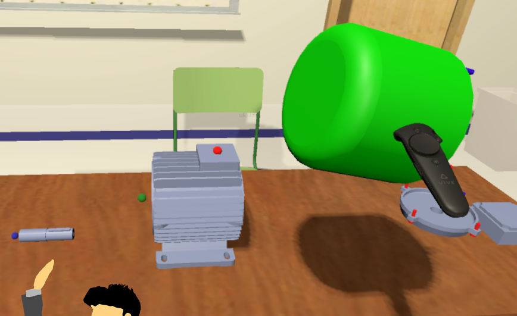

# Ejercicio 1

### Buscar una aplicación de ejemplo, preferiblemente propia, y deducir qué patrón es el que usa. ¿Qué habría que hacer para evolucionar a un patrón tipo microservicios?

La aplicación que he escogido ha sido mi TFG, un programa basado en usar la realidad virtual para simular el montaje de un motor (cuál sea) con la mayor realidad posible. El patrón que sigue la aplicación es monolítico, ya que aunque esta tiene dos partes (una de ensamblaje de un motor y la otra de un caso prático de como darle valores al motor para su correcto funcionamiento) se decidio que fueran en un único programa sin separarlas.
	

Para que esta aplicación evolucionase a un patrón de microservicios, habría que dividir las funcionalidades en partes mas pequeñas pensando en cuales se pueden ejecutar de forma asíncrona. En primer lugar dividiría las dos partes principales, el ensamblaje del motor, y las prácticas de medición de datos. En segundo lugar la parte de ensamblaje se puede dividir más aun ya que tiene distintos modos dentro de la aplicación (modo práctica, modo normal y modo examen). A partir de tener las funcionalidades divididas se puede pensar en añadir otras, por ejemplo poder descargar modelos de motores nuevos para usarlos en la parte de ensamblaje.

