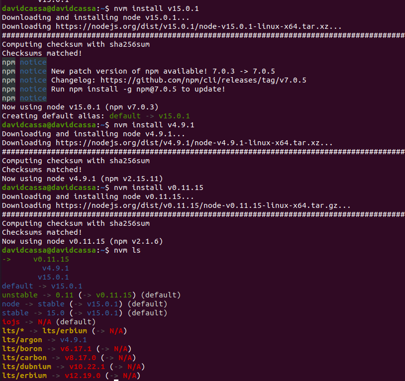

## Ejercicio 2

### Crear una descripción del módulo usando package.json. En caso de que se trate de otro lenguaje, usar el método correspondiente.

Para crear la descripción de un modulo tenemos que usar el comando: npm init.

Una vez usado tenemos que rellenar los campos que nos van apareciendo.

Quedaria algo asi:

En el caso de que queramos añadirele alguna dependencia usaremos el comando:

- npm install <pakage>

