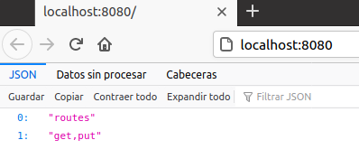
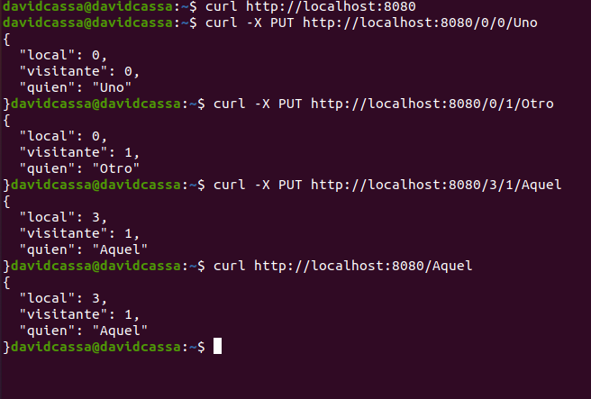

## Ejercicio 2

### Descargar el repositorio de ejemplo anterior, instalar las herramientas necesarias (principalmente Scala y sbt) y ejecutar el ejemplo desde sbt. Alternativamente, buscar otros marcos para REST en Scala tales como Finatra o Scalatra y probar los ejemplos que se incluyan en el repositorio.

En primer lugar vamos a instalar Scala y SBT. Para ello se ha instalado la versión 8 de java, la versión 2.11 de scala ysbt.

Una vez instalado todo hacemos un clone del [repositorio](https://github.com/JJ/spray-test).

Cuando todos los prerrequisitos estan instalados pasamos, seguimos los pasos del readme.

	1º Lanzamos sbt.
	2º Compilamos todo.
	3º Iniciamos la aplicación.
	4º Abrimos la dirección [http://localhost:8080](http://localhost:8080 ).
	
	
	
	5º Ejecutamos unas pruebas.
	
	Este es el resultado:
	
	

	6º Por último paramos el servicio.

