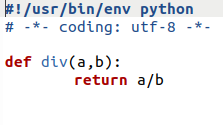
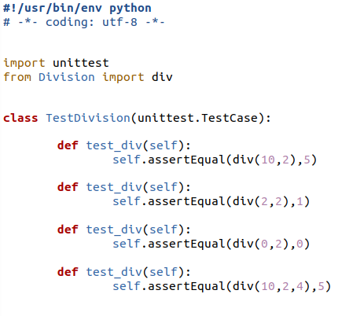

## Ejercicio 2

### Para la aplicación que se está haciendo, escribir una serie de aserciones y probar que efectivamente no fallan. Añadir tests para una nueva funcionalidad, probar que falla y escribir el código para que no lo haga. A continuación, ejecutarlos desde mocha (u otro módulo de test de alto nivel), usando descripciones del test y del grupo de test de forma correcta. Si hasta ahora no has subido el código que has venido realizando a GitHub, es el momento de hacerlo, porque lo vamos a necesitar un poco más adelante.

Para hacer una prueba he escogido el lenguaje python y con el el modulo unittest para realizar la prueba.

Para la prueba he hecho un fichero Divisio.py que contine una función a la que se le introducen dos valores y los divide.

Y después he creado un fichero en el que se van a realizar los test usando unittest.

He puesto cuatro test correctos y uno en el que se le introduce un dato de mas.

Este seria el resultado:

