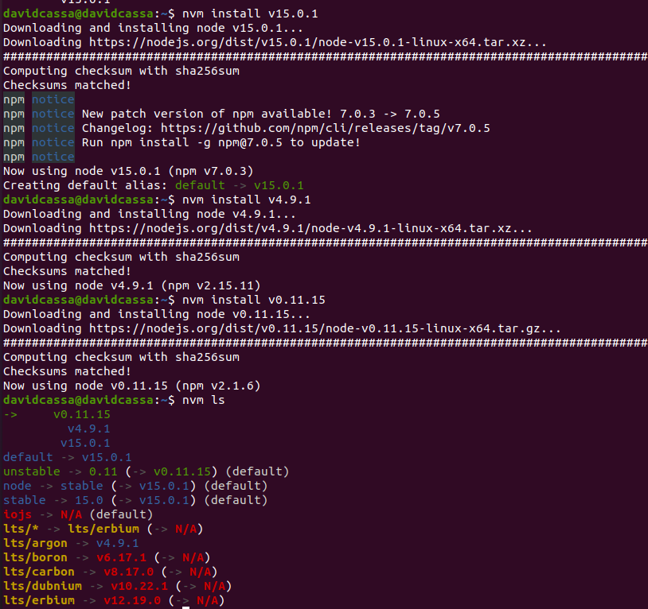

# Ejercicio 1

### Instalar alguno de los entornos virtuales de node.js (o de cualquier otro lenguaje con el que se esté familiarizado) y, con ellos, instalar la última versión existente, la versión minor más actual de la 4.x y lo mismo para la 0.11 o alguna impar (de desarrollo).

Se ha escogido el lenguaje node.js para realizar este ejercicio. Además, el entorno virtual desde el que se va a instalar es nvm.

Para realizar la instalación lo primero que tenemso que hacer es descargar nvm con el comando:

curl https://raw.githubusercontent.com/creationix/nvm/master/install.sh | bash

Una vez descargado usamos la orden nvm --help para ver que podemos usar con nvm.

Usando la orden nvm ls-remote, podemos ver todas las versiones disponibles.

Por último pasamos a instalar las diferentes versiones con las ordenes:
	- nvm install v15.0.1
	- nvm install v4.9.1
	- nvm install v0.11.15
 
 y usamos nvm ls para mostrar todas.

